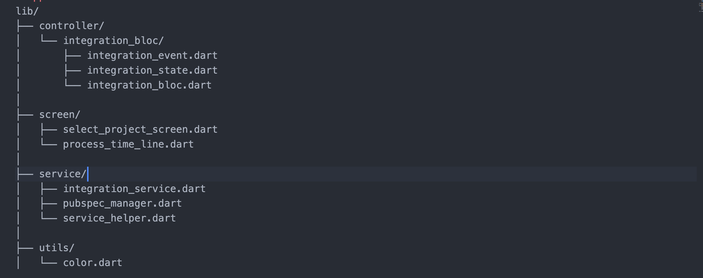
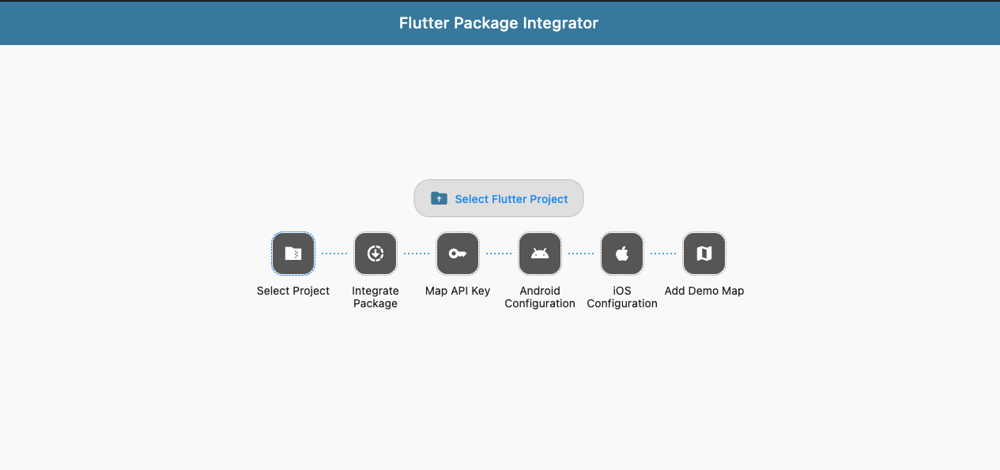

# Google Maps Flutter Auto Integration 

# App Arcitecture

---

## ⚙️ Features

- Select a Flutter project folder.
- Automatically adds `google_maps_flutter` to `pubspec.yaml`.
- Runs `flutter pub get` automatically.
- Configures Android (`AndroidManifest.xml`) and iOS (`AppDelegate.swift`/`.m`, `Info.plist`).
- Inserts Google Maps API keys.
- Replaces the main entry point (`main.dart`) with a demo map.

---

## 🚀 How It Works

### 1️⃣ Select Project Folder
- You’ll be asked to select a Flutter project folder.
- If `pubspec.yaml` is not found, an error message is displayed.
- If valid, the app continues to integration Package.

---

### 2️⃣ Integrate Package
- The app attempts to fetch the latest version of `google_maps_flutter` from the internet.
- If it fails, it adds the dependency as `google_maps_flutter:any`.
- It then runs `flutter pub get` using `Process.run`.

---

### 3️⃣ API Key Setup
- A dialog asks the user to enter a Google Maps API key.
- If provided, the key is used in Android and iOS configurations.
- If skipped, platform files will not include the key.

---

### 4️⃣ Android Configuration
- Ensures the `INTERNET` permission is present in `AndroidManifest.xml`.
- Adds the API key metadata block if a key was provided.

---

### 5️⃣ iOS Configuration
- Detects and updates either `AppDelegate.swift` or `AppDelegate.m`.
- Adds the required Google Maps import and API key initialization.
- Updates `Info.plist` to include:
  - Google Maps API key.
  - Location usage descriptions.

---

### 6️⃣ Main File Setup
- Clears the existing `main.dart` file.
- Adds a minimal working map demo using `google_maps_flutter`.

---

## 📸 Screenshots

---

## 👨‍💻 Author

Created by Gamal Abdel Nasser

